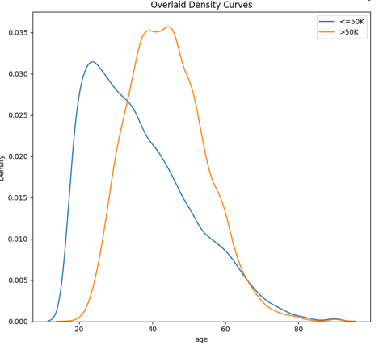
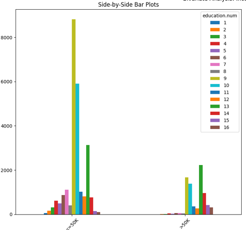
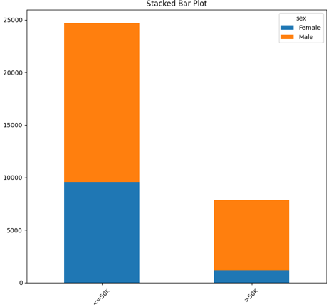
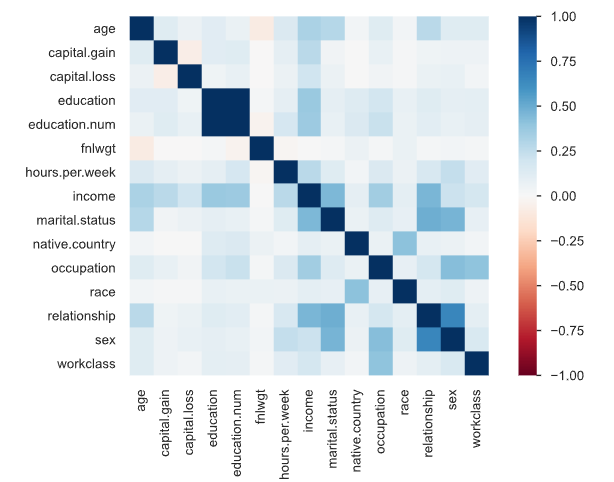
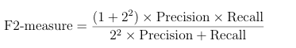

# Exploratory Data Analysys Report

All the base for this report is found in the `artifacts/exploratory_data_analysys` folder. Please, make sure to check this folder

This data was extracted from the [1994 Census bureau database](http://www.census.gov/en.html) by Ronny Kohavi and Barry Becker (Data Mining and Visualization, Silicon Graphics). A set of reasonably clean records was extracted using the following conditions: ((AAGE>16) && (AGI>100) && (AFNLWGT>1) && (HRSWK>0)).  *The prediction task is to determine whether a person makes over $50K a year* .

| FEATURE        |      CLASSIFICATION |
| :------------- | ------------------: |
| age            |             numeric |
| workclass      | categorical-nominal |
| fnlwgt         |             numeric |
| education      | categorical-ordinal |
| education.num  | categorical-ordinal |
| marital.status | categorical-nominal |
| occupation     | categorical-nominal |
| relationship   | categorical-nominal |
| race           | categorical-nominal |
| sex            |  categorical-binary |
| capital.gain   |             numeric |
| capital.loss   |             numeric |
| hours.per.week |             numeric |
| native.country | categorical-nominal |
| income         |       binary-target |

Dataframe dimensions 32561 rows × 15 columns

## **Summary Statistics**

<table border="1" class="dataframe">
  <thead>
    <tr style="text-align: right;">
      <th></th>
      <th>count</th>
      <th>mean</th>
      <th>std</th>
      <th>min</th>
      <th>25%</th>
      <th>50%</th>
      <th>75%</th>
      <th>max</th>
    </tr>
  </thead>
  <tbody>
    <tr>
      <th>age</th>
      <td>32561.0</td>
      <td>38.581647</td>
      <td>13.640433</td>
      <td>17.0</td>
      <td>28.0</td>
      <td>37.0</td>
      <td>48.0</td>
      <td>90.0</td>
    </tr>
    <tr>
      <th>fnlwgt</th>
      <td>32561.0</td>
      <td>189778.366512</td>
      <td>105549.977697</td>
      <td>12285.0</td>
      <td>117827.0</td>
      <td>178356.0</td>
      <td>237051.0</td>
      <td>1484705.0</td>
    </tr>
    <tr>
      <th>education.num</th>
      <td>32561.0</td>
      <td>10.080679</td>
      <td>2.572720</td>
      <td>1.0</td>
      <td>9.0</td>
      <td>10.0</td>
      <td>12.0</td>
      <td>16.0</td>
    </tr>
    <tr>
      <th>capital.gain</th>
      <td>32561.0</td>
      <td>1077.648844</td>
      <td>7385.292085</td>
      <td>0.0</td>
      <td>0.0</td>
      <td>0.0</td>
      <td>0.0</td>
      <td>99999.0</td>
    </tr>
    <tr>
      <th>capital.loss</th>
      <td>32561.0</td>
      <td>87.303830</td>
      <td>402.960219</td>
      <td>0.0</td>
      <td>0.0</td>
      <td>0.0</td>
      <td>0.0</td>
      <td>4356.0</td>
    </tr>
    <tr>
      <th>hours.per.week</th>
      <td>32561.0</td>
      <td>40.437456</td>
      <td>12.347429</td>
      <td>1.0</td>
      <td>40.0</td>
      <td>40.0</td>
      <td>45.0</td>
      <td>99.0</td>
    </tr>
  </tbody>
</table>

## Data Quality

* Dataset has 23 duplicate rows (0.1%); **[1]**
* There are no Missing Values;
* According to the unique values spreadsheet, there are no strange values;
* There are data within different scales **[3]**

### Unique Value Count

| COLUMN         | NunUnique |
| :------------- | --------: |
| age            |        73 |
| workclass      |         9 |
| fnlwgt         |     21648 |
| education      |        16 |
| education.num  |        16 |
| marital.status |         7 |
| occupation     |        15 |
| relationship   |         6 |
| race           |         5 |
| sex            |         2 |
| capital.gain   |       119 |
| capital.loss   |        92 |
| hours.per.week |        94 |
| native.country |        42 |
| income         |         2 |

## Data Distribution

### Univariate

The plots are avaiable at: `artifacts\exploratory_data_analysys\plots\univariate`

* Target is imbalanced   **[2];**

| FEATURE        | SKEWNESS  | DISTRIBUITION                                                                      | OBSERVATION                                                                                            | HAS OUTLIERS [5] |
| -------------- | --------- | ---------------------------------------------------------------------------------- | ------------------------------------------------------------------------------------------------------ | ---------------- |
| age            | 0.558718  | Rouglhy Gaussian                                                                   | Right Skewed                                                                                           | Several          |
| workclass      | N/A       | Most Employes are from Private (69.7%),  followed by Self-emp-not-inc (7.8%) | Highly Imbalancement between classes                                                                   | N/A              |
| fnlwgt         | 1.446913  | Rouglhy Gaussian                                                                   | Right Skewed                                                                                           | Several          |
| education.num  | N/A       | Roughly Gaussian                                                                   | Most people are in 9, 10 and 13 education level                                                        | N/A              |
| marital.status | N/A       | N/A                                                                                | Most people (about 80%) Married-civ-spouse or never married                                            | N/A              |
| occupation     | N/A       | N/A                                                                                | Relatively well distributed across 6 different occupations                                             | N/A              |
| relationship   | N/A       | N/A                                                                                | 40.5% are Husband and 25.5% are not in family                                                          | N/A              |
| race           | N/A       | N/A                                                                                | About 86% White, highly imbalanced                                                                     | N/A              |
| sex            | N/A       | Bernoulli                                                                          | 66.9% Male the 33.1% Female, highly imbalanced                                                         | N/A              |
| capital.gain   | 11.953297 | Not Gaussian                                                                       | Most people do not have capital gain                                                                   | Several          |
| capital.loss   | 4.594417  | Not Gaussian                                                                       | Most people do not have capital loss                                                                   | Several          |
| hours.per.week | 0.227632  | Rouglhy Gaussian, with small tails                                                 | Greate concentration around median                                                                     | Several          |
| native.country | N/A       | N/A                                                                                | Most people (about 90%) areamerican, the  rest is distributed across a lot of different countries | N/A              |
| income         | N/A       | Bernoulli                                                                          | [24% >50k ] and [76% <= 50k] High imbalance [2]                                                        | N/A              |

### Bi-Variate

* Higher incomes become more frequent with age but are concentrated in middle age rather than old age.

* Most people on the group of <= 50k income are from 9th education group, while most people on the >50k education group are on the 13th education group

  
* The proportion of men and women seems to change from the different income groups (The proportion seems to favor men)

  

#### Correlations [4]

There are no data transformation insight from the correlation matrix, except delete the `education` feature

## Conclusions

* **[2]** Binary target is imbalanced, metric and model chooses should consider that (**apply the imbalanced learning framework**)

### Processment Ideas

* **[1]** Drop duplicate rows;
* Drop feature education (education.num) already has this information encoded **[4]**;
* Encode a categorical-nominals (do this in a way to avoid multicorrelation);
* Create a feature to represent the difference between capital.gain and capital.loss(profit);
* Create a feature to represent if the person has any capital.gain (investors)
* Create a feature to represent if the citzen is american or immigrant;
* Change income labels to 0 and 1, Change sex labels to 0 and 1;
* **[2]** Use some resampling technique to improve the model's performance;
* **[5]** There are some outliers, must apply a scaler that is robust to them

# Imbalanced Learning Framework

## Metrics

Regular Metrics can be misleading when we are dealing with imbalanced datasets. For this business problem we have the following situation:

* We want to predict crisp labels (not probabilities);
* The positive class is more important (Possible leads)
* False negatives are more costly (Losing a high purchase power lead is worse than trying to sale for a low purchase power lead)

According to this situation we should Choose the **F2-Score metric**

The F2-score places greater emphasis on recall, ensuring that we capture as many valuable leads as possible, even at the expense of some false positives. This makes it a better fit than F1-score, which balances precision and recall equally, or accuracy, which does not account for class importance.

